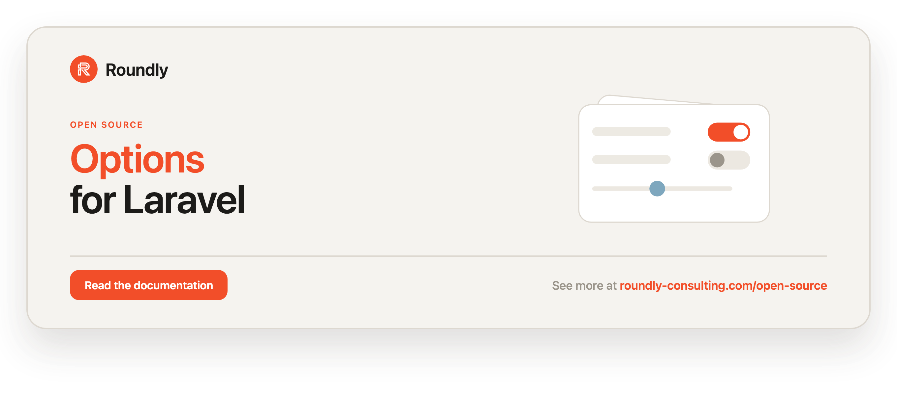

<!-- roundly-hero:start -->
<p align="center">
  <a href="https://roundly-consulting.com/open-source/docs/options-for-laravel?utm_source=github&utm_medium=readme&utm_campaign=open-source&utm_content=options-for-laravel">
    
  </a>
</p>
<!-- roundly-hero:end -->

<!-- roundly-badges:start -->
<p align="center">
  <a href="https://packagist.org/packages/roundly-consulting/options-for-laravel"></a>
  <a href="https://github.com/roundly-consulting/options-for-laravel/actions/workflows/run-tests.yml"></a>
  <a href="https://github.com/roundly-consulting/options-for-laravel/actions/workflows/fix-php-code-style-issues.yml"></a>
  <a href="https://donate.stripe.com/dRmeVe8FX5PF1Qd9pXcEw00"></a>
  <a href="https://www.patreon.com/cw/roundly"></a>
  <a href="https://roundly-consulting.com/support-us?utm_source=github&utm_medium=readme&utm_campaign=open-source&utm_content=options-for-laravel#crypto"></a>
</p>
<!-- roundly-badges:end -->

# Options for Laravel

Global or per-model options, settings and preferences for Laravel. Each option is a small class
with its key, default value, cast and validation rules; values can belong to the whole app or to
any Eloquent model (a user, a team, a tenant) and are cached, typed and evented.

## Installation

Requires PHP 8.4 and Laravel 12 or 13.

```bash
composer require roundly-consulting/options-for-laravel
php artisan vendor:publish --tag="options-migrations"
php artisan migrate
```

If your owner models have UUID/ULID keys, set `OPTIONS_KEY_TYPE` **before** migrating.

## Usage

Describe an option once (`php artisan make:option ThemeOption --key=theme` scaffolds it):

```php
use RoundlyConsulting\Options\BaseOption;

final class ThemeOption extends BaseOption
{
    public function key(): string
    {
        return 'theme';
    }

    public function default(): mixed
    {
        return 'light';
    }

    public function rules(): array|string
    {
        return ['in:light,dark'];
    }
}
```

Then read and write it — globally or for any model:

```php
use RoundlyConsulting\Options\Facades\Options;

Options::get(ThemeOption::class);                 // 'light' — the default until a value is stored
Options::set(ThemeOption::class, 'dark');         // validated against rules(), cached, fires OptionSet

Options::set(ThemeOption::class, 'light', $user); // scoped to one model
Options::for($user)->get(ThemeOption::class);     // 'light'
Options::forget(ThemeOption::class, $user);       // back to the default
```

<!-- roundly-docs:start -->
## Documentation

The full documentation — configuration, every feature and its API, and testing — lives on our
website: **[roundly-consulting.com/open-source/docs/options-for-laravel](https://roundly-consulting.com/open-source/docs/options-for-laravel?utm_source=github&utm_medium=readme&utm_campaign=open-source&utm_content=options-for-laravel)**

Release notes are in [CHANGELOG.md](CHANGELOG.md). To contribute, see the
[contributing guide](https://github.com/roundly-consulting/.github/blob/main/CONTRIBUTING.md).
<!-- roundly-docs:end -->

<!-- roundly-support:start -->
## Support our work

This package is free and open source, built and maintained by
[Roundly Consulting](https://roundly-consulting.com/open-source?utm_source=github&utm_medium=readme&utm_campaign=open-source&utm_content=options-for-laravel).
If it saves you time, please consider supporting our open-source work — a one-time donation, a
monthly pledge on Patreon or a crypto donation helps fund maintenance, new features and new
packages.

<a href="https://donate.stripe.com/dRmeVe8FX5PF1Qd9pXcEw00"></a>
<a href="https://www.patreon.com/cw/roundly"></a>
<a href="https://roundly-consulting.com/support-us?utm_source=github&utm_medium=readme&utm_campaign=open-source&utm_content=options-for-laravel#crypto"></a>
<!-- roundly-support:end -->

## License

The MIT License (MIT). See [LICENSE](LICENSE.md) for details.
